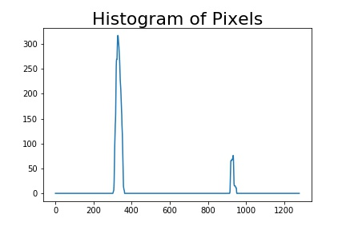

# Advance Lane Line Finding


In this project, advanced computer vision technologies are applied to find lane lines and identify the drivable lane area ahead.
The project first calibrates the camera based on the calibration pattern images, then it goes through following steps for each image/video frame for finding lane lines:
* Correct distortion for image/video frame
* Derive binary image based on the thresholds combination of color space and gradients
* Convert to birds-eye's view through perspective transform
* Detect lane line pixels
   - Use histogram and sliding window to find pixels belongs to lane lines 
   - Or search lane line pixels based on the line positions in previous video frame
* Fit polynomial lane lines and draw lane
* Calculate lane information (curvature, vehicle position relative to lane center, lane width)
* Sanity Check
* Convert back to original perspective
* Visualize the image/video frame with identified lane area, lane curvature, vehicle offset from lane center


## Environment & Output
 - Development Environment:  Conda Virtual Environment, Jupyter Notebook, Python, OpenCV
 - Source Code: P2.ipynb
 - Example resultant Image/Video:  ./output_images/


## Camera Calibration

The images/videos taken from the camera are always distorted due to the relative position and characteristics of the camera sensor. Before processing the images/video frames, we need to correct them by compensating those distortion.
To learn the distortion parameters of a camera, a set of pictures (i.e. calibration image) about a chessboard taken by the camera from different scenarios are presented and studied. The following are some of the pictures used for calibrating camera in this project.

      
      


By studying the relationship of the coordinates between corners in these images and their opponent in reality, we can learn following parameters of the camera:
 - camera matrix
 - distortion coefficients
 - camera sensor rotation vector
 - camera sensor translation vector

Based on these camera parameters, we can correct the distortion for images/video frames. Here below is an example of calibration on one of the calibration image.

<table>
<tr>
<td>
<figure>
    <center>
    
    <figcaption>Calibration Image</figcaption>
     </center>
</figure>
</td>
<td>
<figure>
    <center>
    
    <figcaption>Calibrated Image</figcaption>
    </center>
</figure>
</td>
</tr> 
</table>


*Code:  Section Camera Calibration @P2.ipynb*


## Pipeline
The whole pipeline is implemented as adv_find_lane_lines() in *Section Pipeline @P2.ipynb*

### 1.  Undistort Image/Video Frame
In order to find the lane lines in the image/video frame, the image/video frame should be undistorted with the camera calibration parameters.
The raw test images (left) and their undistorted versions are shown below.

<table>
<tr>
<td>
<figure>
    <center>
    
    <figcaption>Raw Image</figcaption>
     </center>
</figure>
</td>
<td>
<figure>
    <center>
    
    <figcaption>Undistorted Image</figcaption>
    </center>
</figure>
</td>
</tr>

<tr>
<td>
<figure>
    <center>
    
    <figcaption>Raw Image</figcaption>
     </center>
</figure>
</td>
<td>
<figure>
    <center>
    
    <figcaption>Undistorted Image</figcaption>
    </center>
</figure>
</td>
</tr> 

<tr>
<td>
<figure>
    <center>
    
    <figcaption>Raw Image</figcaption>
     </center>
</figure>
</td>
<td>
<figure>
    <center>
    
    <figcaption>Undistorted Image</figcaption>
    </center>
</figure>
</td>
</tr> 

</table>


### 2. Color and Gradient Thresholding
In order to identify the lane lines, the pixels belonging to the lane lines should be detected. To do that, the masks in different color spaces (e.g. RGB, HLS, HSV, Lab, LUV), and also gradient change in different directions and perspectives are defined (e.g. gradient in x-axis, y-axis, magnitude, x-y direction ratio) and combined for extracting the lane pixels.

In this project, after experiments, following combination is used for thresholding images/video frames:
 
 - HSV color space, [20,60,60] ~ [38,174,250] for yellow
 - RGB color space, [200,200,200] ~ [255,255,255] for white
 - Luv color space, (225, 255) for L channel
 - Lab color space, (155, 200) for b channel

Some example of the combined thresholding on test images are shown as following:

<table>
<tr>
<td>
<figure>
    <center>
    
    <figcaption>Undistorted Image</figcaption>
     </center>
</figure>
</td>
<td>
<figure>
    <center>
    
    <figcaption>Thresholded Image</figcaption>
    </center>
</figure>
</td>
</tr>

<tr>
<td>
<figure>
    <center>
    
    <figcaption>Undistorted Image</figcaption>
     </center>
</figure>
</td>
<td>
<figure>
    <center>
    
    <figcaption>Thresholded Image</figcaption>
    </center>
</figure>
</td>
</tr> 

<tr>
<td>
<figure>
    <center>
    
    <figcaption>Undistorted Image</figcaption>
     </center>
</figure>
</td>
<td>
<figure>
    <center>
    
    <figcaption>Thresholded Image</figcaption>
    </center>
</figure>
</td>
</tr> 

</table>


*Code:  Section Color and Gradient Thresholding @P2.ipynb*


### 3. Perspective Transform
After creating color and/or gradient thresholded binary image, perspective transform is carried out to convert to a birds-eye view, which allows easily find the curvature of the lanes.
In order to perform perspective transform, positions of four points in original image and converted image are defined as follows:

 - Source Points: [594,447], [690,447], [1130,720], [195,720]
 - Target Points: [310,0], [960,0], [960,680], [310,680]

The following images show how the perspective transform changes the view of the images/video frames.

<table cellspacing="0" cellpadding="0">
<tr>
<td>
<figure>
    <center>
    
    <figcaption>Thresholded Image</figcaption>
    </center>
</figure>
</td>
<td>
<figure>
    <center>
    
    <figcaption>Birds-Eye View (Binary)</figcaption>
    </center>
</figure>
</td>
</tr>

<tr>
<td>
<figure>
    <center>
    
    <figcaption>Thresholded Image</figcaption>
    </center>
</figure>
</td>
<td>
<figure>
    <center>
    
    <figcaption>Birds-Eye View (Binary)</figcaption>
    </center>
</figure>
</td>
</tr> 

<tr>
<td>
<figure>
    <center>
    
    <figcaption>Thresholded Image</figcaption>
    </center>
</figure>
</td>
<td>
<figure>
    <center>
    
    <figcaption>Birds-Eye View (Binary)</figcaption>
    </center>
</figure>
</td>
</tr> 

</table>


*Code:  Section Perspective Transform @P2.ipynb*


### 4. Lane Line Pixel Detection

To find the pixels belonging to the lane lines, a histogram (illustrated below) is calculated along the y axis of the warped binary image. 



The histogram shows two peaks, which corresponds the base positions of the two lane lines at the bottom of the image. 

From these base positions, sliding windows are defined and used to search for the pixels for the lane lines towards the top of the images. The searching process keeps updating the base positions for the sliding windows based on the distribution of the lane line pixels in the previous window. The searching process is illustrated as following figures:

<table>
<tr>
<td>
<figure>
    <center>
    
    <figcaption>Birds-Eye Perspective</figcaption>
     </center>
</figure>
</td>
<td>
<figure>
    <center>
    
    <figcaption>Sliding Window</figcaption>
    </center>
</figure>
</td>
</tr> 
</table>

*Code:  Section Lane Line Pixel Detection @P2.ipynb*


### 5.  Fit Polynomial Lines for Lane Lines

Once we find the pixels belonging to the lane lines, we can fit polynomial lines to the pixels for drawing the left and right boundary lines of the lane.

A 2nd-degree polynomial line is expressed as f(y) = Ay^2 + By + C

By fitting polynomial lines based on the pixels, we can derive the coefficients (A, B, C).
Based on the coefficients, we can selects the pixels in the image which lie on the lane lines, hence we can draw the lane lines on the image (as shown in the left figure below). Besides, the drivable lane area, which is the area between the two boundary lines of the lane, is also identified and illustrated in the right figure below.

<table>
<tr>
<td>
<figure>
    <center>
    
    <figcaption>Fitting Lane Lines</figcaption>
     </center>
</figure>
</td>
<td>
<figure>
    <center>
    
    <figcaption>Drivable Lane Area</figcaption>
    </center>
</figure>
</td>
</tr> 
</table>

*Code:  Section Fit Polynomial Lines @P2.ipynb*

### 6. Lane Curvature and Vehicle Position
After identifying the lane lines and drivable area, we can calculate the radius of the curvature of the lane.

   Radius = (1+(2*A*y + B)^2)^(3/2)/abs(2*A)

In the formula, A, B are the coefficients of the polynomial line corresponding to the lane line. y is the base position of the lane line at the bottom of the image.

Based on the base positions of the two lane lines, we can estimate the offset of the vehicle from the lane center. The center of the lane is the center of the two base positions of the lane lines at the bottom edge. The vehicle's center position is at the center of the image's x axis. The difference of these lane center and the vehicle center is the offset of the vehicle from the lane center.

So far, all the calculation is based on pixel. To make it practical, we need to calculate the lane curvature and vehicle position in practical units. The relationship between pixel and real length is defined as follows:
 - 720 pixels in y axis equal to 30 meters in reality
 - 700 pixels in x axis equal to 3.7 meters (which is the width of a lane)

*Code:  Section Lane Curvature and Vehicle Position @P2.ipynb*


### 7. Sanity Check
For each lane line detection, we need to check whether the detection is valid. In this project, the following aspects are checked before concluding the validity of the detected lane lines. 
  - Lane curvature: The ratio between the radii of left and right lane lines' curvature should be in range [0.2, 5]
  - Vehicle offset from lane center:  <= 1.0m
  - Detected lane width:  in range [2, 4.4]
  
*Code:  Section Sanity Check @P2.ipynb*


### 8. Transform Back to Original Perspective
Once we have a valid detection of the lane lines and have drawn the drivable area (as shown in previous sections), we need to convert the image back to the original perspective for visualization. This is done through inverse perspective transform as illustrated below.

<table>
<tr>
<td>
<figure>
    <center>
    
    <figcaption>Birds-Eye Perspective</figcaption>
    </center>
</figure>
</td>
<td>
<figure>
    <center>
    
    <figcaption>Original Perspective</figcaption>
    </center>
</figure>
</td>
<td>
<figure>
    <center>
    
    <figcaption>Detected Lane Overlaid</figcaption>
    </center>
</figure>
</td>
</tr> 
</table>


### 9. Optimization for Lane Finding in Video

When we search lane lines in a series of video frames, the positions of the lane lines from one frame to the next will not change significantly. (Camera usually streams frames at a rate 24+ fps.) 
Once we find the lane lines in a frame, in the next frame, we don't need to search blindly with sliding windows as implemented in Section 4. Instead, we can search the line in the new frame based on the information of the previously fitted polynomial lines in previous frame, which is done in function search_around_poly() defined in *Section Optimization for Lane Finding in Video @P2.ipynb*.

To smooth the lane line detection and drawing, a LaneLine class is defined (shown as below), which is used to keep tracking the lane line information in recent frames. The parameters of lane lines to be drawn in current frame are averaged over the parameters in recent frames.

```python
class LaneLine():
    def __init__(self):
        # was the line detected in the last iteration?
        self.last_detected = False  
        # Coefficients of left/right polynomial lines in recent frames
        self.recent_fit_left = []
        self.recent_fit_right = []
        # Current coefficient of left/right polynomial line to be used (for searching in next frame)
        self.best_fit_left = None
        self.best_fit_right = None
        # Number of continuous frames failed to be found lane lines
        # If continuously failed certain times, switch back to raw sliding window search
        self.cont_bad_frames = 0
        # Total frame count
        self.frame_cnt = 0
        # Threshold for recent_fit_left
        self.iterative_win = 3
        # Threshold for continuous bad frames
        self.bad_frames_threshold = 3
        
    def update(self, left_fit, right_fit):
        self.frame_cnt = self.frame_cnt + 1
        if (left_fit is None) or (right_fit is None):
            self.last_detected = False
            self.cont_bad_frames = self.cont_bad_frames + 1
            if self.cont_bad_frames >= self.bad_frames_threshold:
                self.recent_fit_left = []
                self.recent_fit_right = []
                self.best_fit_left = None
                self.best_fit_right = None
        else:
            self.last_detected = True
            self.cont_bad_frames = 0
            self.recent_fit_left.append(left_fit)
            self.recent_fit_right.append(right_fit)
            if len(self.recent_fit_left) > self.iterative_win:
                self.recent_fit_left = self.recent_fit_left[1:]
                self.recent_fit_right = self.recent_fit_right[1:]
            if len(self.recent_fit_left) > 0:
                self.best_fit_left = np.mean(self.recent_fit_left, axis=0)
                self.best_fit_right = np.mean(self.recent_fit_right, axis=0)
```


## Test 

The following figures show the result of lane line finding on the test images.

<table>
<tr>
<td>
<figure>
    <center>
    
    <figcaption>Raw Test Image</figcaption>
     </center>
</figure>
</td>
<td>
<figure>
    <center>
    
    <figcaption>Lane Detected</figcaption>
    </center>
</figure>
</td>
</tr> 


<tr>
<td>
<figure>
    <center>
    
    <figcaption>Raw Test Image</figcaption>
     </center>
</figure>
</td>
<td>
<figure>
    <center>
    
    <figcaption>Lane Detected</figcaption>
    </center>
</figure>
</td>
</tr> 


<tr>
<td>
<figure>
    <center>
    
    <figcaption>Raw Test Image</figcaption>
     </center>
</figure>
</td>
<td>
<figure>
    <center>
    
    <figcaption>Lane Detected</figcaption>
    </center>
</figure>
</td>
</tr> 


<tr>
<td>
<figure>
    <center>
    
    <figcaption>Raw Test Image</figcaption>
     </center>
</figure>
</td>
<td>
<figure>
    <center>
    
    <figcaption>Lane Detected</figcaption>
    </center>
</figure>
</td>
</tr> 

<tr>
<td>
<figure>
    <center>
    
    <figcaption>Raw Test Image</figcaption>
     </center>
</figure>
</td>
<td>
<figure>
    <center>
    
    <figcaption>Lane Detected</figcaption>
    </center>
</figure>
</td>
</tr> 

<tr>
<td>
<figure>
    <center>
    
    <figcaption>Raw Test Image</figcaption>
     </center>
</figure>
</td>
<td>
<figure>
    <center>
    
    <figcaption>Lane Detected</figcaption>
    </center>
</figure>
</td>
</tr> 

<tr>
<td>
<figure>
    <center>
    
    <figcaption>Raw Test Image</figcaption>
     </center>
</figure>
</td>
<td>
<figure>
    <center>
    
    <figcaption>Lane Detected</figcaption>
    </center>
</figure>
</td>
</tr> 

<tr>
<td>
<figure>
    <center>
    
    <figcaption>Raw Test Image</figcaption>
     </center>
</figure>
</td>
<td>
<figure>
    <center>
    
    <figcaption>Lane Detected</figcaption>
    </center>
</figure>
</td>
</tr> 

</table>


The output of lane line finding on videos could be found in ./output_images/*_video_output.mp4


## Discussion

### 1. Problems
The pipeline for lane line finding implemented in this adv_find_lane_lines() in *Section Pipeline @P2.ipynb* works well on the project video (please see output in ./output_images/project_video_output.mp4.

It starts to struggle on challenge scenarios, such as challenge_video.mp4. In even more complicated scenarios like harder_challenge_video.mp4, current pipeline becomes completely useless.

In challenge_video.mp4, the lane lines are less identifiable and some unrelated lines are presented in the lane, which makes it very difficult to design a reasonable thresholding method to extract the lane lines.

In the harder_challenge_video.mp4, the road contains lots of short turns, the drivable lane area in front of the vehicle becomes very short and the length of the visible lane area varies continuously, so the ROI/sliding windows pick up lots of unrelated pixels. Besides, the light condition also keeps changing all the time, a combined color & gradient thresholding works for current frame will become completely useless in the next frame. 

The 3 test videos presents 3 different scenarios of the road layout, pavement, light and other environment conditions. I believe it is very challenging (if it is not impossible) and time-consuming to design one combination of color and gradient thresholding to allow the pipeline to perform well on all the 3 scenarios. Even such a pipeline exists, when we drive in a new environment (which might present different combination of road layout, pavement, light and other environment condition), the pipeline could still fail, i.e. a universal workable combination of thresholding does not exist. I think this is really the limitation of conventional computer vision based solutions in this domain.


### 2. Possible Solutions
#### 2.1 Conventional Computer Vision based Solution
If we stick to conventional computer vision-based solution as presented in this project, the pipeline could be improved from following aspects:

a) Adaptive Thresholding
Instead of using a single combination of color & gradient thresholding, the combination should be changed dynamically based on the road scenario. There should be another daemon pipeline keeping analyzing the road and environment conditions, and instruct the lane detection pipeline to choose proper thresholding on images/video frames.

b) Adaptive Region of Interest
In current implement, the region of interest is fixed. A dynamic ROI could be used to select proper pixels corresponding to the road surface. For example, when the road is straight, it could use a long ROI; in case of snaky road, the pipeline should use short ROI to avoid picking up pixels unrelated to road surface. (Other sensors, such as gyroscope, could help identify whether the road is straight or not.)


#### 2.2 Deep Learning based Solution
All the conventional Computer Vision based solutions face a very challenging task: tune tons of parameters in the pipeline.
I would like to see how/whether deep learning based solutions could give better performance.
